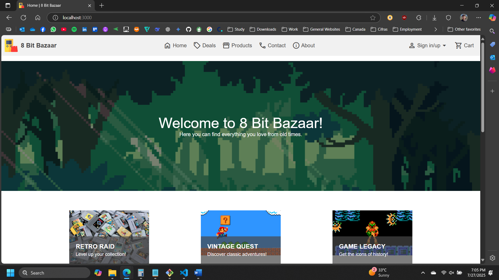
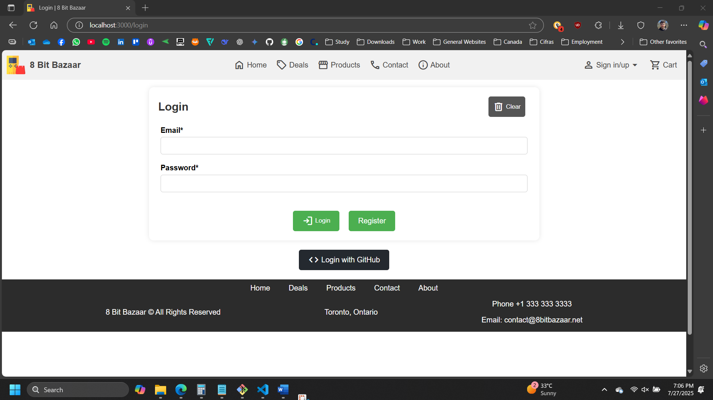
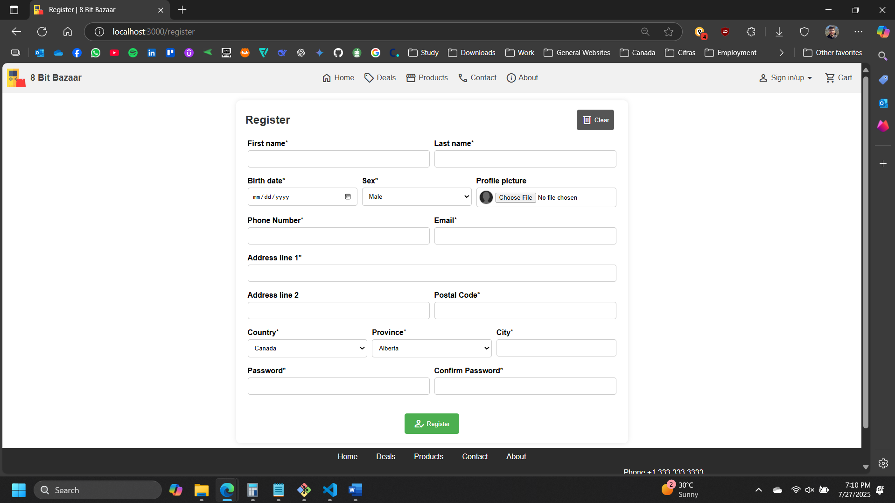
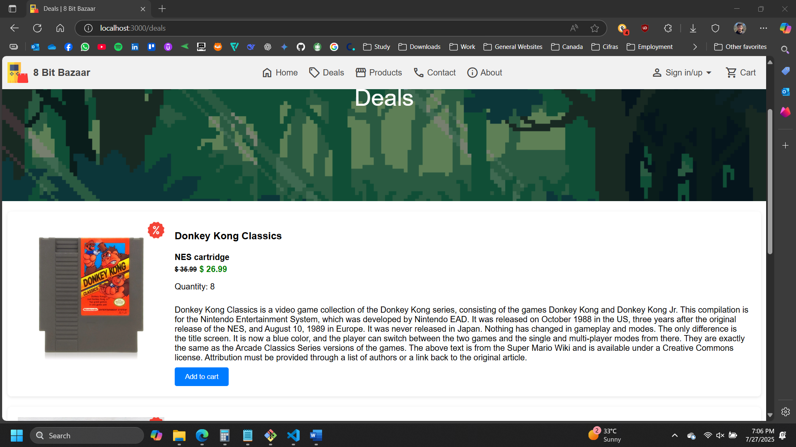
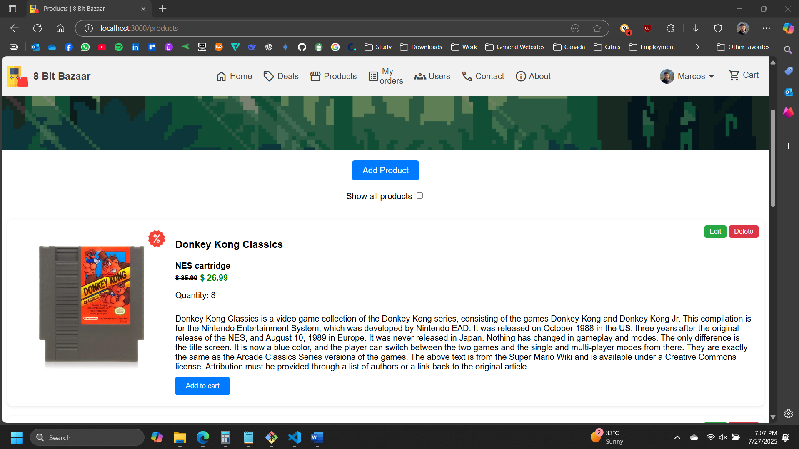
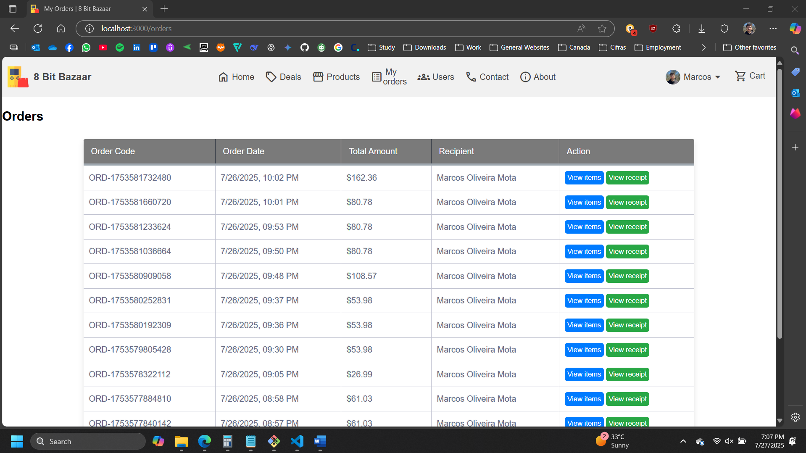
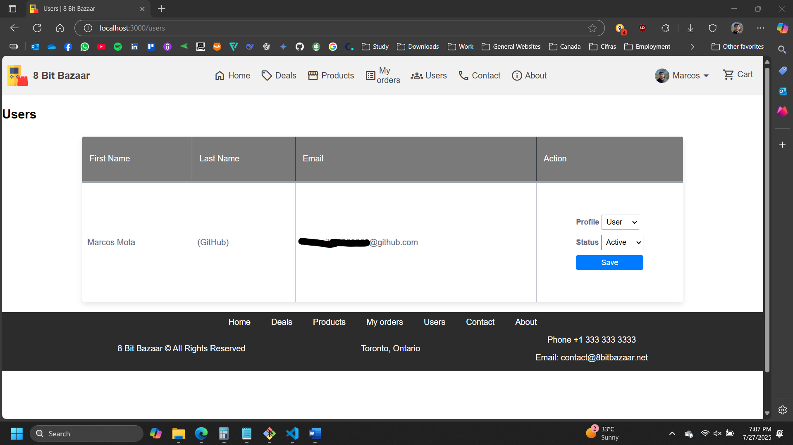

# 8 Bit Bazaar Website

This is a repository of a website created for an assignment, intended for learning purposes.

- **Assignment Detail:** COMP2068 Term Project
- **Created on:** 2025-07-27

## Students Information

- Marcos Oliveira Mota (200564426)
- Henrique Gonçalves (200591288)

## Description

8 Bit Bazaar is a website that enables users to explore and buy old games/products. The user has the option to add products to cart, checkout, see their orders and the details, update their profile and setting a profile image. Admin users also have the option to add, edit and delete (CRUD) products and change users status and profiles.

## Technologies Used

- **Javascript**
- **NODE.js**
- **Express**
- **MongoDB**
- **HTML**
- **CSS**

## Link to Live Demo

<a href="https://github.com/marcosmota5/8BitBazaar" title="Live project">To be added</a>

## Screenshots

### Home page

### Login page

### Register page

### Deals page

### Products page (admin view)

### Orders page (for logged users)

### Users page (admin only)

## Other

Thanks to <a href="https://www.flaticon.com/" title="Flaticon">Flaticon</a> for providing for free so many amazing images. The single favicon in this project comes from Flaticon, so all icon rights are reserved to it.

Thanks also to <a href="https://www.wikipedia.com/" title="Wikipedia">Wikipedia</a> for providing free educational content. The image and description of all games in this website come from Wikipedia, so all rights are reserved to it.

Other images

- <a href="https://www.flaticon.com/free-icons/browser" title="browser icons">Browser icons created by Freepik - Flaticon</a>
- <a href="https://www.flaticon.com/free-icons/8-bit" title="8 bit icons">8 bit icons created by Freepik - Flaticon</a>
- <a href="https://wallpaperaccess.com/8-bit-gif" title="8 bit gif">8 bit gif by Wallpaper Access</a>
